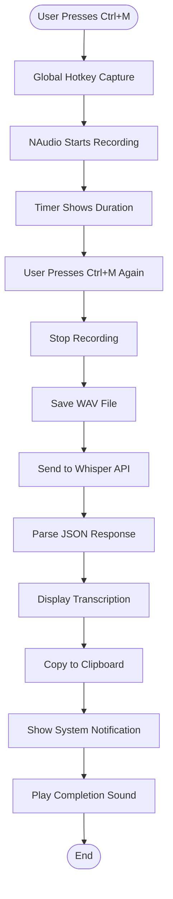

# Whisper Windows - Speech-to-Text Desktop App

[](https://dotnet.microsoft.com/)
[](https://www.microsoft.com/windows)
[](LICENSE)
[](https://openai.com/research/whisper)

English | [简体中文](README.md)

A Windows Forms application built on .NET 6 that enables real-time speech-to-text transcription using NAudio for audio recording and OpenAI Whisper API for transcription.

## 📋 Table of Contents

- [Overview](#overview)
- [Features](#features)
- [Tech Stack](#tech-stack)
- [Architecture](#architecture)
- [Project Structure](#project-structure)
- [Getting Started](#getting-started)
- [Build & Publish](#build--publish)
- [Usage](#usage)
- [Security Considerations](#security-considerations)
- [Troubleshooting](#troubleshooting)
- [License](#license)
- [Contributing](#contributing)

## Overview

Whisper Windows is a lightweight desktop tool that allows users to quickly record audio using a global hotkey (`Ctrl+M`), automatically send the recording to the OpenAI Whisper API for transcription, and have the result copied to the clipboard with system notifications.

### Key Features

- ✅ **Global Hotkey Support**: Control recording with `Ctrl+M` shortcut
- 🎤 **High-Quality Audio Recording**: Records audio at 44.1kHz using NAudio
- 🤖 **AI Speech Recognition**: Integrates OpenAI Whisper API for accurate transcription
- 📋 **Auto-Copy**: Transcription results automatically copied to clipboard
- 🔔 **System Notifications**: Balloon tips and window flashing upon completion
- 🎵 **Audio Feedback**: Plays sounds for recording start, stop, and copy actions
- 📦 **Single-File Publish**: Supports packaging as a single executable

## Features

### 1. Audio Recording System

Uses **NAudio** library for real-time audio capture:

- Sample Rate: 44.1kHz (CD quality)
- Channels: Mono
- Format: WAV

### 2. Global Hotkey

Registers global shortcut via Windows API (`RegisterHotKey`):

- Key Combination: `Ctrl+M`
- Implementation: Win32 API interop
- Functionality: Triggers recording even when app is in background

### 3. API Integration

Integrates with OpenAI Whisper API:

- Model: whisper-1
- Transfer: MultipartFormData
- Authentication: Bearer Token

### 4. User Interface

Simple Windows Forms interface:

- Real-time timer showing recording duration
- Text box displaying transcription results
- Visual recording status indicator

## Tech Stack

**Architecture Diagram:**



### Dependencies

| Package | Version | Purpose |
|---------|---------|---------|
| `NAudio` | 2.2.1 | Audio recording and playback |
| `Microsoft.Toolkit.Uwp.Notifications` | 7.1.3 | Windows 10/11 system notifications |

## Project Structure

```
whisper windows/
├── Form1.cs                    # Main form logic (core code)
├── Form1.Designer.cs           # Main form UI designer code
├── Form1.resx                  # Main form resource file
├── Program.cs                  # Application entry point
├── SettingsForm.cs             # Settings form
├── SettingsForm.Designer.cs    # Settings form designer code
├── SettingsForm.resx           # Settings form resources
├── whisper windows.csproj      # Project configuration file
├── whisper windows.sln         # Solution file
├── logo.ico                    # Application icon
├── .gitignore                  # Git ignore file
├── README.md                   # Chinese README
├── README.en.md                # English README (this file)
├── Properties/
│   ├── Resources.Designer.cs   # Resource access code
│   ├── Resources.resx          # Resource manifest
│   ├── Settings.Designer.cs    # Settings access code
│   └── Settings.settings       # Application settings
└── Resources/
    ├── copy.wav                # Copy completion sound
    ├── start.wav               # Recording start sound
    ├── stop.wav                # Recording stop sound
    └── logo.ico                # Icon resource
```

## Getting Started

### Prerequisites

- Windows 10/11
- .NET 6.0 SDK or higher
- Microphone device
- OpenAI API Key (for Whisper API)

### Installation

1. **Clone the repository**

```bash
git clone https://github.com/lihaoz-barry/whisper-windows.git
cd whisper-windows
```

2. **Configure API Key**

⚠️ **Important**: Replace the API key in `Form1.cs` at line 259:

```csharp
client.DefaultRequestHeaders.Add("Authorization", "Bearer YOUR_API_KEY_HERE");
```

**See [Security Considerations](#security-considerations) for best practices.**

3. **Restore dependencies**

```bash
dotnet restore
```

4. **Run the application**

```bash
dotnet run
```

## Build & Publish

### Method 1: Using Visual Studio Code

This project includes VSCode tasks for building and publishing.

#### Available Tasks:

1. **Build**
   - Shortcut: `Ctrl+Shift+B`
   - Compiles the project for debugging

2. **Publish**
   - Generates production-ready single-file executable
   - Output: `bin/Release/net6.0-windows/win-x64/publish/`

3. **Clean**
   - Removes all build artifacts

#### Usage:

1. Press `Ctrl+Shift+P` to open command palette
2. Type "Tasks: Run Task"
3. Select desired task (Build/Publish/Clean)

### Method 2: Command Line

#### Development Build

```bash
dotnet build
```

#### Publish Single-File Executable

```bash
dotnet publish -c Release -r win-x64 --self-contained true -p:PublishSingleFile=true
```

**Publish Parameters:**
- `-c Release`: Use Release configuration
- `-r win-x64`: Target Windows x64 runtime
- `--self-contained true`: Include .NET runtime (no .NET installation required)
- `-p:PublishSingleFile=true`: Package as single EXE file

**Output Location:**
```
bin/Release/net6.0-windows/win-x64/publish/whisper windows.exe
```

## Usage

1. Launch the application
2. Press `Ctrl+M` to start recording (or click "Start" button)
3. Speak your content
4. Press `Ctrl+M` again to stop recording
5. App automatically sends audio to Whisper API
6. Transcription result appears in text box and is copied to clipboard
7. System notification displays the result

## Security Considerations

⚠️ **Important Security Notice**

### API Key Management

The current version hardcodes the API Key in the source code ([`Form1.cs:259`](Form1.cs#L259)), which is **NOT recommended practice**.

**Risks:**
- If code is made public, API Key may be exposed
- Others could use your API Key and incur charges
- Violates OpenAI terms of service

**Recommended Practices:**

1. **Use Environment Variables** (Recommended)

```csharp
// Read API Key from environment variable
string apiKey = Environment.GetEnvironmentVariable("OPENAI_API_KEY");
client.DefaultRequestHeaders.Add("Authorization", $"Bearer {apiKey}");
```

Set environment variable in Windows:
```powershell
setx OPENAI_API_KEY "your-api-key-here"
```

2. **Use Configuration File**

Create `appsettings.json` (remember to add to `.gitignore`):
```json
{
  "OpenAI": {
    "ApiKey": "your-api-key-here"
  }
}
```

3. **Use Windows Credential Manager**

Store sensitive information in the system's credential manager.

### Pre-Commit Checklist

- [ ] Ensure API Key is removed from code
- [ ] Verify `.gitignore` includes all sensitive files
- [ ] Don't commit `*.user` and `.vs/` files
- [ ] Don't commit recorded audio files (`*.wav`)

### If API Key is Accidentally Exposed

1. Immediately go to [OpenAI API Keys](https://platform.openai.com/api-keys) and revoke the key
2. Generate a new API Key
3. Check your OpenAI billing for any unusual usage

## Troubleshooting

### Issue: Cannot Record Audio

**Solution:**
- Check microphone permissions (Settings → Privacy → Microphone)
- Confirm default recording device is set correctly

### Issue: API Call Fails

**Solution:**
- Verify API Key is valid
- Check network connection
- Ensure OpenAI account has sufficient balance

### Issue: Hotkey Not Working

**Solution:**
- Confirm no other app is using `Ctrl+M`
- Run app with administrator privileges
- Check if hotkey registration succeeded (debug logs)

## License

MIT License

## Contributing

Issues and Pull Requests are welcome!

## Author

Barry ([lihaoz-barry](https://github.com/lihaoz-barry))

---

**Last Updated:** 2025-11-23
**Repository:** https://github.com/lihaoz-barry/whisper-windows
