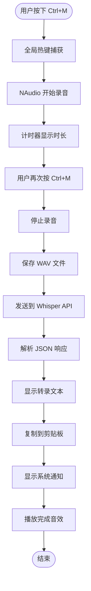

# Whisper Windows - 语音转文字桌面应用

[](https://dotnet.microsoft.com/)
[](https://www.microsoft.com/windows)
[](LICENSE)
[](https://openai.com/research/whisper)

[English](README.en.md) | 简体中文

一个基于 .NET 6 的 Windows Forms 应用程序，通过 NAudio 实现音频录制，并集成 OpenAI Whisper API 进行实时语音转文字服务。

## 📋 目录

- [项目概述](#项目概述)
- [核心功能](#核心功能)
- [技术架构](#技术架构)
- [实现细节](#实现细节)
- [项目结构](#项目结构)
- [快速开始](#快速开始)
- [构建和发布](#构建和发布)
- [代码示例](#代码示例)
- [使用说明](#使用说明)
- [安全注意事项](#安全注意事项)
- [故障排除](#故障排除)
- [许可证](#许可证)
- [贡献](#贡献)

## 项目概述

Whisper Windows 是一个轻量级的桌面工具，允许用户通过快捷键（Ctrl+M）快速录制音频，并自动将录音发送到 OpenAI Whisper API 进行转录。转录结果会自动复制到剪贴板，并通过系统通知显示。

### 主要特性

- ✅ **全局热键支持**：使用 `Ctrl+M` 快捷键控制录音开始/停止
- 🎤 **高质量音频录制**：使用 NAudio 以 44.1kHz 采样率录制音频
- 🤖 **AI 语音识别**：集成 OpenAI Whisper API 进行准确的语音转文字
- 📋 **自动复制**：转录结果自动复制到剪贴板
- 🔔 **系统通知**：完成转录后显示气泡提示和窗口闪烁
- 🎵 **音效反馈**：录音开始、停止、复制时播放对应音效
- 📦 **单文件发布**：支持打包为单个可执行文件

## 核心功能

### 1. 音频录制系统

使用 **NAudio** 库实现实时音频捕获：

- 采样率：44.1kHz（CD 音质）
- 声道：单声道
- 格式：WAV

### 2. 全局热键

通过 Windows API (`RegisterHotKey`) 注册全局快捷键：

- 组合键：`Ctrl+M`
- 实现：Win32 API interop
- 作用：即使应用在后台也能触发录音

### 3. API 集成

与 OpenAI Whisper API 集成：

- 模型：whisper-1
- 传输：MultipartFormData
- 认证：Bearer Token

### 4. 用户界面

简洁的 Windows Forms 界面：

- 实时计时器显示录音时长
- 文本框显示转录结果
- 可视化录音状态

## 技术架构



## 实现细节

### 核心文件解析

#### 1. [`Form1.cs`](file:///c:/Users/Barry/source/repos/whisper%20windows/Form1.cs) - 主要逻辑文件 (352 行)

这是应用程序的核心实现文件，包含所有主要功能。

**关键类和字段：**

| 成员 | 类型 | 作用 | 行号 |
|------|------|------|------|
| `waveSource` | `WaveIn` | NAudio 音频输入源 | 55 |
| `waveFile` | `WaveFileWriter` | WAV 文件写入器 | 56 |
| `outputFileName` | `string` | 录音文件路径 | 59 |
| `isRecording` | `Boolean` | 录音状态标志 | 60 |
| `startTime` | `DateTime` | 录音开始时间 | 53 |

**核心方法：**

##### A. 热键注册与处理

```csharp
// 注册全局热键（Form1 构造函数中，第 64 行）
RegisterHotKey(this.Handle, MYACTION_HOTKEY_ID, 0x2, (int)Keys.M);  // 0x2 = Ctrl

// Windows 消息处理（第 80-89 行）
protected override void WndProc(ref Message m)
{
    base.WndProc(ref m);
    
    if (m.Msg == 0x0312 && m.WParam.ToInt32() == MYACTION_HOTKEY_ID) // 0x0312 = WM_HOTKEY
    {
        ToggleRecording(); // 触发录音切换
    }
}
```

**实现原理：**
- 使用 Win32 API `RegisterHotKey` 注册系统级快捷键
- 重写 `WndProc` 方法监听 `WM_HOTKEY (0x0312)` 消息
- 收到消息后调用 `ToggleRecording()` 切换录音状态

##### B. 音频录制（第 152-172 行）

```csharp
private void StartRecording()
{
    waveSource = new WaveIn();
    waveSource.WaveFormat = new WaveFormat(44100, 1); // 44.1kHz, 单声道
    
    // 注册事件处理器
    waveSource.DataAvailable += waveSource_DataAvailable;
    waveSource.RecordingStopped += waveSource_RecordingStopped;
    
    // 创建文件写入器
    waveFile = new WaveFileWriter(outputFileName, waveSource.WaveFormat);
    
    // 开始录音
    waveSource.StartRecording();
}
```

**数据流处理（第 247-254 行）：**

```csharp
private void waveSource_DataAvailable(object sender, WaveInEventArgs e)
{
    if (waveFile != null)
    {
        waveFile.Write(e.Buffer, 0, e.BytesRecorded); // 写入音频数据
        waveFile.Flush(); // 立即刷新到磁盘
    }
}
```

**实现原理：**
- `WaveIn` 从默认音频输入设备捕获音频
- `DataAvailable` 事件持续触发，提供音频缓冲区
- `WaveFileWriter` 将缓冲区数据写入 WAV 文件

##### C. Whisper API 调用（第 255-287 行）

```csharp
private async void SendAudioToWhisperAPI(string filePath)
{
    using (var client = new HttpClient())
    {
        // 设置认证头
        client.DefaultRequestHeaders.Add("Authorization", 
            "Bearer sk-proj-...");
        
        // 构建 multipart/form-data 请求
        var content = new MultipartFormDataContent();
        var fileContent = new ByteArrayContent(File.ReadAllBytes(filePath));
        fileContent.Headers.ContentType = 
            new MediaTypeHeaderValue("audio/wav");
        
        content.Add(fileContent, "file", Path.GetFileName(filePath));
        content.Add(new StringContent("whisper-1"), "model");
        
        // 发送请求
        var response = await client.PostAsync(
            "https://api.openai.com/v1/audio/transcriptions", content);
        var resultText = await response.Content.ReadAsStringAsync();
        
        // 解析 JSON 响应
        var jsonDocument = System.Text.Json.JsonDocument.Parse(resultText);
        var text = jsonDocument.RootElement.GetProperty("text").GetString();
        
        // 显示并复制结果
        textBox1.Text = text;
        Clipboard.SetText(text);
        PlaySound("whisper_windows.Resources.copy.wav");
    }
}
```

**API 请求格式：**
```
POST https://api.openai.com/v1/audio/transcriptions
Content-Type: multipart/form-data

file: <binary WAV data>
model: whisper-1
```

**响应格式：**
```json
{
  "text": "转录的文本内容"
}
```

##### D. 窗口闪烁与通知（第 32-43, 289-309 行）

```csharp
// Win32 API 窗口闪烁
public static void FlashWindow(Form form)
{
    FLASHWINFO fw = new FLASHWINFO();
    fw.cbSize = Convert.ToUInt32(Marshal.SizeOf(fw));
    fw.hwnd = form.Handle;
    fw.dwFlags = FLASHW_ALL; // 闪烁标题栏和任务栏
    fw.uCount = 5; // 闪烁 5 次
    fw.dwTimeout = 0;
    
    FlashWindowEx(ref fw);
}

// 系统托盘通知
private void showBalloonTip(string translatedText)
{
    NotifyIcon notifyIcon = new NotifyIcon();
    notifyIcon.Icon = SystemIcons.Information;
    notifyIcon.Visible = true;
    
    notifyIcon.ShowBalloonTip(3000, "Whisper Window", 
        $"Result：{translatedText}", ToolTipIcon.Info);
    
    // 4 秒后自动隐藏
    System.Windows.Forms.Timer timer = new System.Windows.Forms.Timer();
    timer.Interval = 4000;
    timer.Tick += (s, e) => {
        notifyIcon.Visible = false;
        notifyIcon.Dispose();
        timer.Stop();
    };
    timer.Start();
}
```

##### E. 音效播放（第 97-114 行）

```csharp
private void PlaySound(string soundFile)
{
    // 从嵌入资源加载音频
    Assembly assembly = Assembly.GetExecutingAssembly();
    using (Stream stream = assembly.GetManifestResourceStream(soundFile))
    {
        if (stream == null)
        {
            Console.WriteLine("Cannot find resource: " + soundFile);
            return;
        }
        using (var player = new SoundPlayer(stream))
        {
            player.Play(); // 播放音效
        }
    }
}
```

**嵌入资源：**
- `whisper_windows.Resources.start.wav` - 开始录音
- `whisper_windows.Resources.stop.wav` - 停止录音
- `whisper_windows.Resources.copy.wav` - 复制完成

#### 2. [`Program.cs`](file:///c:/Users/Barry/source/repos/whisper%20windows/Program.cs) - 应用入口 (17 行)

```csharp
[STAThread]
static void Main()
{
    ApplicationConfiguration.Initialize();
    Application.Run(new Form1()); // 启动主窗体
}
```

**关键点：**
- `[STAThread]` 属性：必须用于 Windows Forms 应用，确保 COM 组件正确工作
- `ApplicationConfiguration.Initialize()`：初始化应用程序配置（.NET 6+ 新 API）

#### 3. [`Form1.Designer.cs`](file:///c:/Users/Barry/source/repos/whisper%20windows/Form1.Designer.cs) - UI 设计器代码 (124 行)

**UI 组件：**

| 控件 | 类型 | 作用 |
|------|------|------|
| `button1` | `Button` | 手动控制录音开始/停止 |
| `label1` | `Label` | 显示录音时长（mm:ss 格式） |
| `textBox1` | `TextBox` | 显示转录结果（只读） |
| `timer1` | `Timer` | 每秒更新时长显示 |
| `flowLayoutPanel1` | `FlowLayoutPanel` | 布局容器 |

#### 4. [`SettingsForm.cs`](file:///c:/Users/Barry/source/repos/whisper%20windows/SettingsForm.cs) - 设置窗口 (64 行)

预留的 API Key 设置窗口（当前未完全实现）。

#### 5. [`whisper windows.csproj`](file:///c:/Users/Barry/source/repos/whisper%20windows/whisper%20windows.csproj) - 项目配置 (83 行)

**关键配置：**

```xml
<PropertyGroup>
  <TargetFramework>net6.0-windows</TargetFramework>
  <OutputType>WinExe</OutputType>
  <UseWindowsForms>true</UseWindowsForms>
  
  <!-- 单文件发布配置 -->
  <PublishSingleFile>true</PublishSingleFile>
  <SelfContained>true</SelfContained>
  <RuntimeIdentifier>win-x64</RuntimeIdentifier>
  
  <!-- 图标 -->
  <ApplicationIcon>logo.ico</ApplicationIcon>
</PropertyGroup>

<ItemGroup>
  <!-- NuGet 依赖 -->
  <PackageReference Include="NAudio" Version="2.2.1" />
  <PackageReference Include="Microsoft.Toolkit.Uwp.Notifications" Version="7.1.3" />
</ItemGroup>

<ItemGroup>
  <!-- 嵌入音效资源 -->
  <EmbeddedResource Include="Resources\copy.wav" />
  <EmbeddedResource Include="Resources\start.wav" />
  <EmbeddedResource Include="Resources\stop.wav" />
</ItemGroup>
```

### 依赖包

| 包名 | 版本 | 用途 |
|------|------|------|
| `NAudio` | 2.2.1 | 音频录制和播放 |
| `Microsoft.Toolkit.Uwp.Notifications` | 7.1.3 | Windows 10/11 系统通知 |

## 项目结构

```
whisper windows/
├── Form1.cs                    # 主窗体逻辑（核心代码）
├── Form1.Designer.cs           # 主窗体 UI 设计器代码
├── Form1.resx                  # 主窗体资源文件
├── Program.cs                  # 应用程序入口点
├── SettingsForm.cs             # 设置窗体
├── SettingsForm.Designer.cs    # 设置窗体设计器代码
├── SettingsForm.resx           # 设置窗体资源
├── whisper windows.csproj      # 项目配置文件
├── whisper windows.sln         # 解决方案文件
├── logo.ico                    # 应用程序图标
├── Properties/
│   ├── Resources.Designer.cs   # 资源访问代码
│   ├── Resources.resx          # 资源清单
│   ├── Settings.Designer.cs    # 设置访问代码
│   └── Settings.settings       # 应用程序设置
└── Resources/
    ├── copy.wav                # 复制完成音效
    ├── start.wav               # 开始录音音效
    ├── stop.wav                # 停止录音音效
    └── logo.ico                # 图标资源
```

## 快速开始

### 前置要求

- Windows 10/11
- .NET 6.0 SDK 或更高版本
- 麦克风设备
- OpenAI API Key（用于 Whisper API）

### 安装步骤

1. **克隆仓库**

```bash
git clone <repository-url>
cd "whisper windows"
```

2. **配置 API Key**

在 [`Form1.cs`](file:///c:/Users/Barry/source/repos/whisper%20windows/Form1.cs) 第 259 行替换您的 API Key：

```csharp
client.DefaultRequestHeaders.Add("Authorization", "Bearer YOUR_API_KEY_HERE");
```

3. **还原依赖**

```bash
dotnet restore
```

4. **运行应用**

```bash
dotnet run
```

## 构建和发布

### 方法 1：使用 Visual Studio Code

本项目已配置 VSCode 任务，可直接在编辑器中构建和发布。

#### 可用任务：

1. **Build（构建）**
   - 快捷键：`Ctrl+Shift+B`
   - 编译项目生成调试版本

2. **Publish（发布）**
   - 生成生产就绪的单文件可执行程序
   - 输出路径：`bin/Release/net6.0-windows/win-x64/publish/`

3. **Clean（清理）**
   - 删除所有构建产物

#### 使用方法：

1. 按 `Ctrl+Shift+P` 打开命令面板
2. 输入 "Tasks: Run Task"
3. 选择所需任务（Build/Publish/Clean）

或者使用快捷键 `Ctrl+Shift+B` 快速构建。

### 方法 2：命令行

#### 开发构建

```bash
dotnet build
```

#### 发布单文件可执行程序

```bash
dotnet publish -c Release -r win-x64 --self-contained true -p:PublishSingleFile=true
```

**发布参数说明：**
- `-c Release`：使用 Release 配置
- `-r win-x64`：目标运行时为 Windows x64
- `--self-contained true`：包含 .NET 运行时（无需安装 .NET）
- `-p:PublishSingleFile=true`：打包为单个 EXE 文件

**输出位置：**
```
bin/Release/net6.0-windows/win-x64/publish/whisper windows.exe
```

### 方法 3：使用 Visual Studio

1. 右键点击项目 → "发布"
2. 选择发布配置文件
3. 点击"发布"按钮

## 代码示例

### 示例 1：自定义快捷键

修改 [`Form1.cs`](file:///c:/Users/Barry/source/repos/whisper%20windows/Form1.cs) 第 64 行：

```csharp
// 改为 Ctrl+Shift+R
RegisterHotKey(this.Handle, MYACTION_HOTKEY_ID, 0x2 | 0x4, (int)Keys.R);
// 0x2 = Ctrl, 0x4 = Shift
```

**修饰键常量：**
- `0x1` - Alt
- `0x2` - Ctrl
- `0x4` - Shift
- `0x8` - Win

### 示例 2：更改音频采样率

修改 [`Form1.cs`](file:///c:/Users/Barry/source/repos/whisper%20windows/Form1.cs) 第 155 行：

```csharp
// 从 44.1kHz 改为 16kHz（节省带宽）
waveSource.WaveFormat = new WaveFormat(16000, 1);
```

### 示例 3：添加录音设备选择

```csharp
// 列出所有录音设备
for (int i = 0; i < WaveIn.DeviceCount; i++)
{
    var deviceInfo = WaveIn.GetCapabilities(i);
    Console.WriteLine($"设备 {i}: {deviceInfo.ProductName}");
}

// 选择指定设备（在 StartRecording 中）
waveSource = new WaveIn();
waveSource.DeviceNumber = 1; // 使用第二个设备
```

### 示例 4：禁用自动复制到剪贴板

注释掉 [`Form1.cs`](file:///c:/Users/Barry/source/repos/whisper%20windows/Form1.cs) 第 277 行：

```csharp
// Clipboard.SetText(text); // 禁用自动复制
```

## 使用说明

1. 启动应用程序
2. 按下 `Ctrl+M` 开始录音（或点击"Start"按钮）
3. 说话内容会被录制
4. 再次按 `Ctrl+M` 停止录音
5. 应用自动发送音频到 Whisper API
6. 转录结果显示在文本框并自动复制到剪贴板
7. 系统通知会弹出显示结果

## 安全注意事项

⚠️ **重要安全提醒**

### API Key 管理

当前版本的 API Key 是硬编码在源代码中的（[`Form1.cs:259`](file:///c:/Users/Barry/source/repos/whisper%20windows/Form1.cs#L259)），这**不是推荐的做法**。

**风险：**
- 如果代码被公开，API Key 可能会被泄露
- 他人可能使用你的 API Key 产生费用
- 违反 OpenAI 的使用条款

**推荐做法：**

1. **使用环境变量**（推荐）

```csharp
// 从环境变量读取 API Key
string apiKey = Environment.GetEnvironmentVariable("OPENAI_API_KEY");
client.DefaultRequestHeaders.Add("Authorization", $"Bearer {apiKey}");
```

在 Windows 中设置环境变量：
```powershell
setx OPENAI_API_KEY "your-api-key-here"
```

2. **使用配置文件**

创建 `appsettings.json`（记得添加到 `.gitignore`）：
```json
{
  "OpenAI": {
    "ApiKey": "your-api-key-here"
  }
}
```

3. **使用 Windows Credential Manager**

使用系统的凭据管理器存储敏感信息。

### 提交代码前的检查清单

- [ ] 确保 API Key 已从代码中移除
- [ ] 检查 `.gitignore` 包含所有敏感文件
- [ ] 不要提交 `*.user` 和 `.vs/` 文件
- [ ] 不要提交录音文件（`*.wav`）

### 如果不小心泄露了 API Key

1. 立即前往 [OpenAI API Keys](https://platform.openai.com/api-keys) 撤销该 Key
2. 生成新的 API Key
3. 检查你的 OpenAI 账单，确认是否有异常使用

## 故障排除

### 问题：无法录音

**解决方案：**
- 检查麦克风权限（设置 → 隐私 → 麦克风）
- 确认默认录音设备已正确设置

### 问题：API 调用失败

**解决方案：**
- 验证 API Key 是否有效
- 检查网络连接
- 确认 OpenAI 账户有足够余额

### 问题：快捷键不工作

**解决方案：**
- 确认没有其他应用占用 `Ctrl+M`
- 以管理员权限运行应用
- 检查是否成功注册热键（调试日志）

## 许可证

MIT License

## 贡献

欢迎提交 Issue 和 Pull Request！

## 作者

Barry

---

**最后更新：** 2025-11-23
